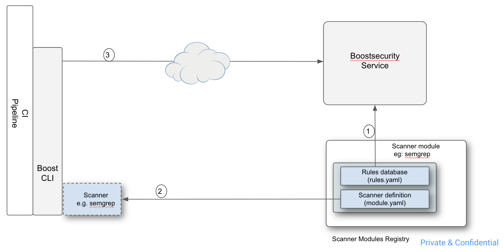
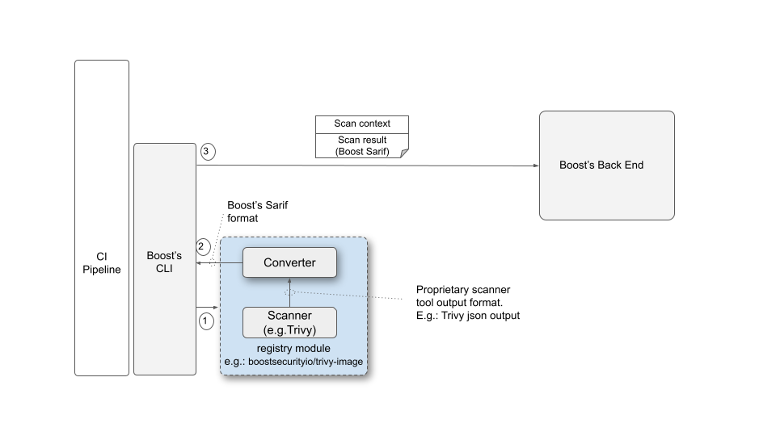
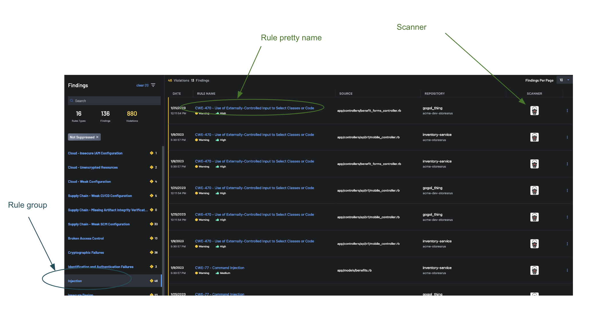
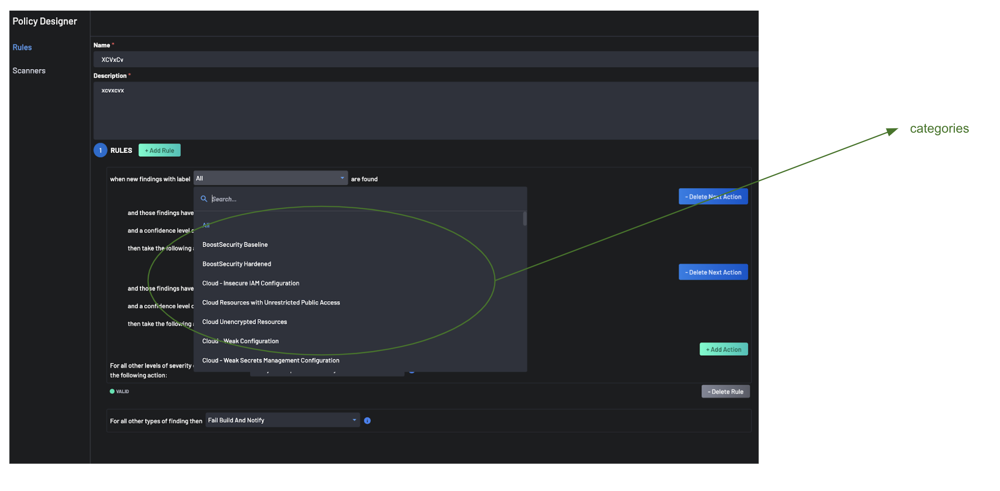

# Boostsecurity Scanner Module Guide
Guide for the Boostsecurity Scanner Module creators that want to integrate security scanners to the Boostsecurity platform. Modules are the way to integrate the scanner output to the Boostsecurity platform. The Boostsecurity CLI will use the Module configuration to execute the scanner, parse the results and send those to the platform.

## Architecture Overview

A scanner module includes two components:

- A rules database
- A module definition



The rules database provides annotation and enrichment data for each rule id that can be raised by the scanner. The enrichment data includes amongst other things a list of labels each rules is associated with, which are used by security engineers when defining policies. 

The module definition provides the configuration for the CLI to execute the scanner in the CI environment. Amongst other things, the module definition includes the configuration for the set up, the scanner execution and the post processing steps. The post processing is the converter, transforming the output of the scanner into the expected payload by the CLI.

The architecture for the scanner components:



 1. The Boostsecurity CLI launches the scanner (as defined in module yaml).
 2. The Boostsecurity CLI runs the converter on the scanner output (as defined by the post-processing in module yaml). The sarif output from the converter needs to be compliant with Boostsecurity’s taxonomies.
 3. The Boostsecurity CLI creates the scanner context (org, repo, branch info, etc..), computes the fingerprint on sarif results and uploads the scan results to the Boostsecurity backend.

## Module Definition
The module.yaml file defines the module behavior and its configuration. The file is located in the root of the module directory and defines how to deal with the various phases:
    
  1. [Scanning Setup](#scanning-setup)
  2. [Scanning](#scan-with-container-image)
  3. [Post-Scanning](#scan-post-processing)

### Module Header
```yaml
api_version: 1.0 # Boostsecurity CLI Module API Version

id: <id> # Unique ID of the module
name: <name> # Display Name of the module
namespace: <namespace> # Namespace of the module rules
```
Namespace is used to group module rules. Rules can be shared across multiple modules if they are in the same namespace.

### Differential and Full Scanning
The Boostsecurity CLI can run modules in two different modes: differential and main scanning. The differential scanning mode is used to scan only the files that have changed between two commits. This is usually used in the context of Pull Requests to only scan the changes introduced. The full(or main) scanning mode is used to scan the whole codebase.

```yaml
config:
  support_diff_scan: true # true if the module supports differential scanning
```

### Scanning Formats
The Boostsecurity CLI can ingest the scanner output in different formats: Sarif and CycloneDX. The module.yaml file defines the supported format of a Module.

The CycloneDX format is used for SBOM modules and Sarif is for asset security scanning.

```yaml
steps:
- scan:
    command:
      ...
    format: sarif # sarif or cyclonedx
```


#### Sarif
The Sarif output format is a JSON based format that is used by many security scanners. Sarif is the expected format for security scan results. The Boostsecurity CLI will parse the Sarif output and send the results to the Boostsecurity platform.

The Boostsecurity platform provides extensions to the Sarif format, known as [Taxonomies](schemas/sarif-schema.json), which are used to provide additional metadata about findings issued by various scanners.

The following types of findings are supported by the platform:

 * Static application security testing(SAST) Scan Result
    
   [SAST Scan Result JSON Schema](schemas/sast-schema.json)
 * Software Composition Analysis(SCA) Result
    
   [SCA Scan Result JSON Schema](schemas/sca-schema.json)
 * Container Scan Result
    
   Similar to an SCA type but with extra metadata about the container image.
  
   [Container Scan Result JSON Schema](schemas/container-schema.json)


#### CycloneDX
The CycloneDX is a Software Bill of Materials(SBOM) format used to inventory the software components used in a project. The Boostsecurity CLI will parse the CycloneDX output and send the results to the platform. Results will be visible in the SBOM section.

### Scanning

#### Scanning Setup
The optional setup section may be used to download or prepare utilities that would be used by this module. These steps will be executed only once before the scans occur.

In subsequent steps, any files made available in this temporary directory may be referenced via the `$SETUP_PATH` variable.

```yaml
setup:
  - name: Install post-processing dependency
    run: |
      curl -fsSL -O "https://github.com/stedolan/jq/releases/download/jq-1.6/jq-linux64"
      echo "af986793a515d500ab2d35f8d2aecd656e764504b789b66d7e1a0b727a124c44  jq-linux64" | sha256sum --check
      chmod +x jq-linux64
```

#### Scan with Container Image
The container image is pulled and run inside the CI environment to execute the scan.
```yaml
steps:
- scan:
    command:
      docker:
        image: <image>
        command: <container command> # optional
        entrypoint: <container entrypoint> # optional
        workdir: <container workdir> # optional the git repo will be mounted to this directory
        environment:
          ENVVARIABLE: <value>
    format: ...
```


#### Scan with Executable
The executable is run inside the CI environment to execute the scan. Requires that the executable has been installed in the setup step.
```yaml
steps:
- scan:
    command:
      environment:
        ENVVARIABLE: <value>
      run: |
        $SETUP_PATH/<executable>
    format: ...
```

#### Scan Post-Processing
The post-processing step is used to process the scanner output before sending it to the Boostsecurity platform. It is executed after the scan step and is optional.

##### Post-Processing using a Container Image
```yaml
steps:
- scan:
    command:
      ...
    format: ...
    post-processor:
      docker:
        image: <image>
        command: <container command>
        environment:
          ENVVARIABLE: <value>
```
##### Post-Processing using an Executable
Requires the executable to have been installed in the setup step.
```yaml
steps:
- scan:
    command:
      ...
    format: ...
    post-processor:
      run: $SETUP_PATH/<executable>
```

## Module Rules
Module rules are used to enrich the findings to ensure the policy processing per proper group or categories as well as the proper display of the description in the Boostsecurity platform. 

The rules are defined in the rules.yaml file. The file is located in the root of the module directory.

```yaml
rules:
  G111: # Unique ID of the rule
    categories: # Categories/Labels of the rule. The available options are defined in the Boostsecurity platform.
    - ALL
    - cwe-22
    - boost-baseline
    - boost-hardened
    - cwe-top-25
    - owasp-top-10
    group: top10-broken-access-control # Group of the rule. Used for display and aggregation in the Boostsecurity platform. The available groups are defined in the platform.
    name: G111 # Unique ID of the rule
    pretty_name: 'G111: Potential directory traversal' # Display name of the rule
    description: <description>
    ref: <ref> # Reference URL of the rule
  ...
```

categories:
  The list of labels the rule is associated with. Policies can be designed by making decisions based on labels. In that case, all rules with the same label are covered by the same policy.
  Refer to Appendix A for list of categories.

group:
  Rules are grouped so that related findings are presented as part of the same group in the dashboard.
  Refer to Appendix B for the list of supported groups.





### Leveraging rules from other rules namespace
When defining the rules for a scanner module, it is sometimes desirable to reuse rules in some other modules. For example if the scanner module creates findings with the same rule id as for another exisitng scanner module, or a curated rules database.
To reuse an existing rules database, import the rules files with the following syntax:
```yaml
import:
  - boostsecurityio/mitre-cwe
  - <other realm>/<curated rules>
```
Multiple rules definition files can be imported. Note that the order of precedence is from bottom to top of the list. Which means if rules with the same rule id are defined in multiple of the imported rules file, the last loaded rule is the one that has precedence. That includes the rules defined locally. If a rule is defined locally has the same id as one of the rules imported, the rule defined locally has precedence. By leveraging the import mechanism it is thus possible to leveraging existing, curated rules definition, but redefine some rules to adapt to the scanner module specific behaviour.

### Defining a default rule
The scanner module might generate findings with rule id that haven't been included in the rules database. It can be the case for example if the scanner includes a very large number of rules, but it was deemed that only a portion of these were important in the context of the scanner module. When a finding was generated from a rule for which the id doesn't exist in the scanner module rules database, BoostSecurity processes the finding generically, by reporting the finding using the scanner original rule id and attributing the finding to a generic rule group and category. 
It is usually desirable to have a scanner module specific default behaviour for rules that are not included in the scanner module rules database, rather than relying on the generic default behaviour. 
A default rule can be included in the scanner module rules database. The default rule is declared at the bottom of the scanner module's rules database file with the following syntax:
```yaml
default:
  CWE-UNKNOWN:   # rule id that will be reported by default>
    categories:  # the categories for the unknown rule>
    - ALL
    - boost-hardened
    group: top10-insecure-design
    name: CWE-UNKNOWN   <name is the same as rule id>
    pretty_name: CWE-UNKNOWN - Original rule did not map to a known CWE rule
    description: The original rule could not be map to a CWE rule
    ref: https://github.com/returntocorp/semgrep-rules/  # some reference
```

Note that the default rules can also be redefined locally if there are also default rules imported from other rules databases.


### Redefining rules definition in SARIF

## Taxonomies
Taxonomies are required for proper parsing and processing of results in the Boostsecurity platform. Sarif output without taxonomies will not be parsed by the platform.
### SAST
```json
{
  "$schema": "https://raw.githubusercontent.com/oasis-tcs/sarif-spec/master/Documents/CommitteeSpecifications/2.1.0/sarif-schema-2.1.0.json",
  "version": "2.1.0",
  "runs": [
     {
        "tool": {
           "driver": {
              "name": "checkov",
              "organization": "bridgecrew",
              "version": "2.0.563",
              "rules": [
                 {
                    "id": "BOOST_AWS_130",
                    "relationships": [
                       {
                          "target": {
                             "id": "BOOST_AWS_130",
                             "index": -1,
                             "toolComponent": {
                                "name": "boost/sast",
                                "index": -1
                             }
                          },
                          "kinds": [
                             "relevant"
                          ]
                       }
                    ]
                 }
              ],
              "supportedTaxonomies": [
                 {
                    "name": "boost/sast",
                    "index": -1
                 }
              ]
           },
           "extensions": []
        },
        "results": [
           {
              "ruleId": "BOOST_AWS_130",
              "level": "warning",
              "message": {
                 "text": "Ensure VPC subnets do not assign public IP by default",
                 "arguments": []
              },
              "taxa": [
                 {
                    "id": "BOOST_AWS_130",
                    "index": -1,
                    "toolComponent": {
                       "name": "boost/sast",
                       "index": -1
                    }
                 }
              ]
           }
        ],
        "taxonomies": [
           {
              "name": "boost/sast",
              "organization": "boostsecurity",
              "version": "1.0.0",
              "notifications": [],
              "rules": [],
              "taxa": [
                 {
                    "id": "BOOST_AWS_130",
                    "name": "aws-vpc-assign-public-ip",
                    "relationships": []
                 }
              ]
           }
        ]
     }
  ]
}

```

### SCA
```json
{
  "$schema": "https://raw.githubusercontent.com/oasis-tcs/sarif-spec/master/Documents/CommitteeSpecifications/2.1.0/sarif-schema-2.1.0.json",
  "version": "2.1.0",
  "runs": [
    {
      "tool": {
        "driver": {
          "name": "npm audit",
          "rules": [
            {
              "id": "1089153",
              "shortDescription": {
                "text": "jsonwebtoken (<=8.5.1)"
              },
              "fullDescription": {
                "text": "jsonwebtoken's insecure implementation of key retrieval function could lead to Forgeable Public/Private Tokens from RSA to HMAC (<=8.5.1)"
              },
              "relationships": [
                {
                  "target": {
                    "id": "cve-moderate",
                    "index": -1,
                    "toolComponent": {
                      "name": "boost/sca",
                      "index": -1
                    }
                  },
                  "kinds": [
                    "relevant"
                  ]
                }
              ]
            },
            {
              "id": "1090161",
              "shortDescription": {
                "text": "luxon (>=2.0.0 <2.5.2)"
              },
              "fullDescription": {
                "text": "Luxon Inefficient Regular Expression Complexity vulnerability (>=2.0.0 <2.5.2)"
              },
              "relationships": [
                {
                  "target": {
                    "id": "cve-high",
                    "index": -1,
                    "toolComponent": {
                      "name": "boost/sca",
                      "index": -1
                    }
                  },
                  "kinds": [
                    "relevant"
                  ]
                }
              ]
            }
          ],
          "supportedTaxonomies": [
            {
              "name": "boost/sca",
              "index": -1
            }
          ]
        }
      },
      "results": [
        {
          "ruleId": "1089153",
          "level": "warning",
          "message": {
            "text": "This file introduces a vulnerable jsonwebtoken npm package with a moderate severity vulnerability."
          },
          "taxa": [
            {
              "id": "cve-moderate",
              "index": -1,
              "toolComponent": {
                "name": "boost/sca",
                "index": -1
              },
              "properties": {
                "tags": [],
                "advisory_link": "https://github.com/advisories/GHSA-hjrf-2m68-5959",
                "cve": "GHSA-hjrf-2m68-5959",
                "cvss_score": 5.0,
                "impacted_versions": "<=8.5.1",
                "package_name": "jsonwebtoken",
                "package_ecosystem": "npm"
              }
            }
          ]
        },
        {
          "ruleId": "1090161",
          "message": {
            "text": "This file introduces a vulnerable luxon npm package with a high severity vulnerability.",
            "arguments": []
          },
          "taxa": [
            {
              "id": "cve-high",
              "index": -1,
              "toolComponent": {
                "name": "boost/sca",
                "index": -1
              },
              "properties": {
                "tags": [],
                "advisory_link": "https://github.com/advisories/GHSA-3xq5-wjfh-ppjc",
                "cve": "GHSA-3xq5-wjfh-ppjc",
                "cvss_score": 7.5,
                "impacted_versions": ">=2.0.0 <2.5.2",
                "package_name": "luxon",
                "package_ecosystem": "npm"
              }
            }
          ]
        }
      ],
      "taxonomies": [
        {
          "name": "boost/sca",
          "organization": "boostsecurity",
          "version": "1.0.0",
          "notifications": [],
          "rules": [],
          "taxa": [
            {
              "id": "cve-unknown",
              "defaultConfiguration": {
                "enabled": true,
                "level": "none",
                "rank": -1.0
              },
              "relationships": []
            },
            {
              "id": "cve-low",
              "defaultConfiguration": {
                "enabled": true,
                "level": "note",
                "rank": -1.0
              },
              "relationships": []
            },
            {
              "id": "cve-moderate",
              "defaultConfiguration": {
                "enabled": true,
                "level": "warning",
                "rank": -1.0
              },
              "relationships": []
            },
            {
              "id": "cve-high",
              "defaultConfiguration": {
                "enabled": true,
                "level": "error",
                "rank": -1.0
              },
              "relationships": []
            },
            {
              "id": "cve-critical",
              "defaultConfiguration": {
                "enabled": true,
                "level": "error",
                "rank": -1.0
              },
              "relationships": []
            }
          ],
          "supportedTaxonomies": []
        }
      ]
    }
  ]
}
```
### Container
```json
{
  "$schema": "https://raw.githubusercontent.com/oasis-tcs/sarif-spec/master/Documents/CommitteeSpecifications/2.1.0/sarif-schema-2.1.0.json",
  "version": "2.1.0",
  "runs": [
    {
      "tool": {
        "driver": {
          "name": "trivy",
          "rules": [
            {
              "id": "CVE-2022-37434",
              "name": "CVE-2022-37434",
              "shortDescription": {
                "text": "zlib: heap-based buffer over-read and overflow in inflate() in inflate.c via a large gzip header extra field"
              },
              "fullDescription": {
                "text": "zlib through 1.2.12 has a heap-based buffer over-read or buffer overflow in inflate in inflate.c via a large gzip header extra field. NOTE: only applications that call inflateGetHeader are affected. Some common applications bundle the affected zlib source code but may be unable to call inflateGetHeader (e.g., see the nodejs/node reference)."
              },
              "relationships": [
                {
                  "target": {
                    "id": "cve-critical",
                    "toolComponent": {
                      "name": "boost/cont_scanning"
                    }
                  }
                }
              ]
            }
          ],
          "supportedTaxonomies": [
            {
              "name": "boost/cont_scanning"
            }
          ]
        }
      },
      "invocations": [
        {
          "executionSuccessful": true
        }
      ],
      "results": [
        {
          "ruleId": "CVE-2022-37434",
          "level": "error",
          "message": {
            "text": "zlib: heap-based buffer over-read and overflow in inflate() in inflate.c via a large gzip header extra field"
          },
          "taxa": [
            {
              "id": "cve-critical",
              "toolComponent": {
                "name": "boost/cont_scanning"
              },
              "properties": {
                "tags": [
                  "your-image:tag"
                ],
                "advisory_link": "https://avd.aquasec.com/nvd/cve-2022-37434",
                "cve": "CVE-2022-37434",
                "cvss_score": 9.8,
                "ecosystem": "alpine",
                "image_name": "your-image",
                "image_version": "sha256:bcf064d8bd917f52798522dbe7f201e335282f0066c6c777e44552bd79f8e946",
                "layer_id": "sha256:5b7df235d876e8cd4a2a329ae786db3fb152eff939f88379c49bcaaabbafbd9c",
                "package_name": "zlib"
              }
            }
          ]
        }
      ],
      "taxonomies": [
        {
          "name": "boost/cont_scanning",
          "taxa": [
            {
              "id": "cve-critical"
            },
            {
              "id": "cve-high"
            },
            {
              "id": "cve-low"
            },
            {
              "id": "cve-moderate"
            },
            {
              "id": "cve-unknown"
            }
          ]
        }
      ]
    }
  ]
}


```
## Examples

### Security Scanner using Container
```yaml
api_version: 1.0

id: boostsecurityio/brakeman
name: BoostSecurity Brakeman
namespace: boostsecurityio/brakeman

config:
  support_diff_scan: true
  require_full_repo: true

steps:
  - scan:
      command:
        docker:
          image: presidentbeef/brakeman:latest@sha256:7416e4cf46131d5f920be496485d30d55a9b9f00acec28847ae1e5f10ac837f4
          command: --format json --quiet --no-pager --no-exit-on-warn --no-exit-on-error --force /src
          workdir: /src
      format: sarif
      post-processor:
        docker:
          image: public.ecr.aws/boostsecurityio/boost-scanner-brakeman:0b71fa2@sha256:1cf820c9b7eb7c5869814ca125b220d788f6a0cf02f83266bb722a9a2674240a

```
### Security Scanner using an executable(With multi arch support)
```yaml
api_version: 1.0


id: boostsecurityio/osv-scanner
name: BoostSecurity osv-scanner
namespace: boostsecurityio/osv-scanner


config:
   support_diff_scan: true
   include_files:
   - buildscript-gradle.lockfile
   - Cargo.lock
   - composer.lock
   - conan.lock
   - Gemfile.lock
   - go.mod
   - gradle.lockfile
   - mix.lock
   - package-lock.json
   - packages.lock.json
   - Pipfile.lock
   - pnpm-lock.yaml
   - poetry.lock
   - pom.xml
   - pubspec.lock
   - requirements.txt
   - yarn.lock

setup:
- name: Install OSV-Scanner
  environment:
     VERSION: 1.1.0
     LINUX_X86_64_SHA: 73b3b297f0a9a3fa28ea45fd45b3b9e74e5a0044ec1c03693a4e8aff0d169f86
     LINUX_ARM64_SHA: fed5a1109f45410d8bcecba852aab48f1812b5254e3cfdd2950ef9330e9e29c2
     MACOS_ARM64_SHA: 65fa9c435535fd58cc1fd6878a09009c44d608c749c41b8f7a7e4727cda0e6ee
  run: |
     BINARY_URL="https://github.com/google/osv-scanner/releases/download/v${VERSION}"
     ARCH=$(uname -m)
     case "$(uname -sm)" in
       "Linux x86_64")
         BINARY_URL="${BINARY_URL}/osv-scanner_${VERSION}_linux_amd64"
         SHA="${LINUX_X86_64_SHA} osv-scanner"
         ;;
       "Linux aarch64")
         BINARY_URL="${BINARY_URL}/osv-scanner_${VERSION}_linux_arm64"
         SHA="${LINUX_ARM64_SHA} osv-scanner"
         ;;
       "Darwin arm64")
         BINARY_URL="${BINARY_URL}/osv-scanner_${VERSION}_darwin_arm64"
         SHA="${MACOS_ARM64_SHA} osv-scanner"
         ;;
       *)
         echo "Unsupported machine: ${OPTARG}"
         exit 1
         ;;
     esac
     curl -o osv-scanner -fsSL "${BINARY_URL}"
     echo "${SHA}" | sha256sum --check

     chmod +x osv-scanner

steps:
- scan:
     command:
        run: |
           if ! $SETUP_PATH/osv-scanner --recursive --json .; then
             if test $? -gt 2; then
               echo "osv-scanner failed to execute"
               exit 1
             fi
           fi
        environment:
           HOME: /tmp
     format: sarif
     post-processor:
        docker:
           image: public.ecr.aws/boostsecurityio/boost-converter-sca:0b7418a@sha256:231b8276beb9fb14258a77cf53d799bac1e77f35b89fd587ad1228d79df88984
           command: process --scanner osv
           environment:
              PYTHONIOENCODING: utf-8
```
### SBOM Module Example
```yaml
api_version: 1.0

id: boostsecurityio/trivy-sbom
name: BoostSecurity Trivy (FS SBOM)
namespace: boostsecurityio/trivy-sbom


config:
  support_diff_scan: false


steps:
 - scan:
     command:
       docker:
        image: aquasec/trivy:0.37.3@sha256:906c909a441949317c252039ce8543ef79bcb9a59e7dd9b94e619191b82fedd2
        command: fs --format=cyclonedx --cache-dir=/tmp/trivy/ /app
        workdir: /app
     format: cyclonedx
```


## Appendix A - supported list of categories

The list of categories defined and supported in Boostsecurity:
```
ALL
boost-baseline
boost-hardened
cloud-insecure-iam
cloud-resources-public-access
cloud-unencrypted-resources
cloud-weak-configuration
cloud-weak-secrets-management
cwe-1004
cwe-1022
cwe-1104
cwe-116
cwe-119
cwe-1236
cwe-125
cwe-1254
cwe-1275
cwe-1327
cwe-1333
cwe-1336
cwe-185
cwe-20
cwe-200
cwe-22
cwe-250
cwe-259
cwe-269
cwe-276
cwe-284
cwe-285
cwe-287
cwe-295
cwe-297
cwe-306
cwe-310
cwe-311
cwe-319
cwe-320
cwe-326
cwe-327
cwe-328
cwe-338
cwe-345
cwe-346
cwe-352
cwe-369
cwe-399
cwe-400
cwe-434
cwe-470
cwe-489
cwe-494
cwe-502
cwe-522
cwe-565
cwe-601
cwe-611
cwe-614
cwe-693
cwe-703
cwe-704
cwe-706
cwe-732
cwe-74
cwe-77
cwe-777
cwe-778
cwe-78
cwe-79
cwe-798
cwe-862
cwe-89
cwe-90
cwe-913
cwe-915
cwe-918
cwe-94
cwe-943
cwe-95
cwe-96
cwe-top-25
insufficient-logging
owasp-top-10
stored-secrets
supply-chain
supply-chain-cicd-severe-issues
supply-chain-cicd-vulnerable-pipeline
supply-chain-cicd-weak-configuration
supply-chain-missing-artifact-integrity-verification
supply-chain-scm-weak-configuration
vulnerable-and-outdated-components
```

## Appendix B - supported list of categories

The list of groups defined and supported in Boostsecurity:
```
top10-broken-access-control
top10-crypto-failures
top10-injection
top10-insecure-design
top10-security-misconfiguration
top10-vulnerable-components
top10-id-authn-failures
top10-software-data-integrity-failures
top10-security-logging-monitoring-failures
top10-server-side-request-forgery
stored-secrets
cloud-weak-configuration
cloud-resources-public-access
cloud-insecure-iam
cloud-unencrypted-resources
cloud-weak-secrets-management
supply-chain-scm-weak-configuration
supply-chain-cicd-vulnerable-pipeline
supply-chain-cicd-weak-configuration
supply-chain-missing-artifact-integrity-verification
supply-chain-malicious-dependency
supply-chain-unrestrained-use-of-3rd-party-services
```